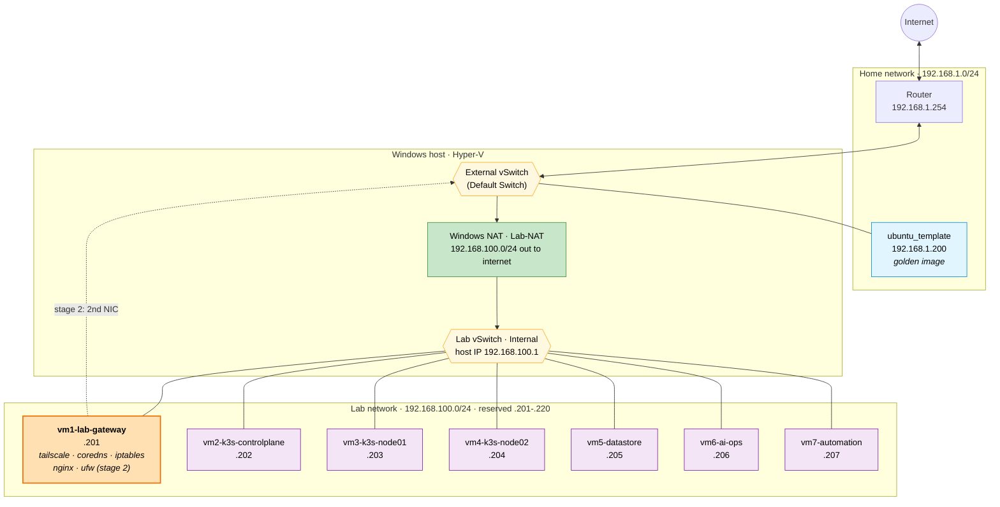
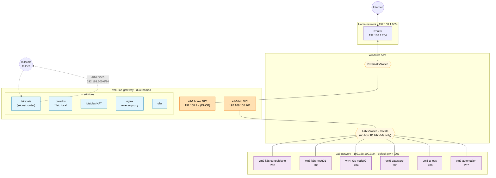

# Hyper-V Home Lab

Personal homelab running on a Windows host with Hyper-V. Seven Ubuntu VMs on an isolated virtual network, provisioned from a single template. Used for k3s, data stores, AI/ops tooling, and automation work.

For operational details (how to run scripts, add VMs, troubleshoot), see [`scripts/README.md`](./scripts/README.md). This file is just the big picture.

## What's in this folder

```
C:\vmimages\
  ISO\               Ubuntu install ISOs (used once to build the template)
  Exports\HyperV\    Exported template VM, used as the golden image for cloning
    template\          (copied from this by New-LabVM at provision time)
  VMs\               Live Hyper-V VM files (one folder per lab VM)
  seeds\             Cloud-init seed ISOs, one per lab VM, generated at provision time
  scripts\           Numbered PowerShell scripts that build, verify, and destroy the lab
  architecture\      Structurizr DSL (C4 model) source for the architecture diagrams
  runbooks\          Stage-by-stage operational guides (what was done, why, how to verify / roll back)
  README.md          You are here (architecture overview)
```

## Network architecture

Two separate networks. Home network keeps being home. Lab network is walled off behind Windows NAT. The dashed link is the stage 2 upgrade path (see below).



Traffic flow today: `lab VM → 192.168.100.1 (Windows host) → Lab-NAT → External NIC → router → internet`. Nothing from the home network can reach the lab subnet unless explicitly routed. DNS suffix across the lab is `lab.local`, configured via cloud-init so `ssh lab-datastore` works from any lab VM without typing the suffix.

## The fleet

| VM | Hostname | IP | Role |
|---|---|---|---|
| `vm1-lab-gateway` | `lab-gateway.lab.local` | `192.168.100.201` | Will host Tailscale, CoreDNS, iptables NAT, nginx reverse proxy, ufw (stage 2) |
| `vm2-lab-k3s-controlplane` | `lab-k3s-controlplane.lab.local` | `192.168.100.202` | k3s control plane |
| `vm3-lab-k3s-node01` | `lab-k3s-node01.lab.local` | `192.168.100.203` | k3s worker |
| `vm4-lab-k3s-node02` | `lab-k3s-node02.lab.local` | `192.168.100.204` | k3s worker |
| `vm5-lab-datastore` | `lab-datastore.lab.local` | `192.168.100.205` | Databases, object store, backups |
| `vm6-lab-ai-ops` | `lab-ai-ops.lab.local` | `192.168.100.206` | Model serving, observability, ops tooling |
| `vm7-lab-automation` | `lab-automation.lab.local` | `192.168.100.207` | Schedulers, workflow runners, ad-hoc jobs |

Default sizing: 4 GB RAM, 2 vCPU per VM. Override per VM in `scripts\00-config.ps1` or by passing `-MemoryMB` / `-CPUs` to `New-LabVM`.

## How it's built

Everything rolls up from a single golden template. The template is a regular Hyper-V Ubuntu VM that has been cleaned: cloud-init reset, SSH host keys wiped, machine-id blanked, NoCloud datasource pinned. It lives on the External switch at `192.168.1.200` so the prep scripts can SSH in over the home network.

Each clone gets made by:

1. `Import-VM` with `-Copy -GenerateNewId` from the template export.
2. A per-VM cloud-init seed ISO generated on the fly: user-data (hostname, SSH key, packages, runcmds), meta-data (instance-id, local-hostname), network-config (static IP, gateway, DNS, search domain).
3. Seed ISO attached as a DVD drive, VM booted, cloud-init runs once on first boot, hostname/IP/hosts/packages all come up configured.
4. Seed ISO ejected after the VM responds on its expected IP.

Zero console typing per clone. Adding an 8th VM is two lines in `$LAB_VMS` and one script run.

## Stage 1 vs Stage 2

**Stage 1 (foundation)**: All eight VMs on the Lab switch, Windows host doing NAT. Fully automated in [`scripts/`](./scripts/). Lab isolated from the home network.

**Stage 2 (in progress)**: `lab-gateway` takes over as the real gateway. Get a second NIC on the home network, run Tailscale (remote access + subnet router), CoreDNS (lab-local resolution), iptables NAT (lab egress), nginx (reverse proxy for lab services), and ufw. Other VMs flip their default gateway from `.1` to `.201`. Windows host steps back and becomes just an admin console. Optionally the Lab vSwitch gets switched from Internal to Private later.

Stage 2 is additive on top of stage 1, no rebuild required. Progress is tracked step by step in [`runbooks/`](./runbooks/):

| Step | Capability | Status |
|---|---|---|
| 1 | Tailscale on lab-gateway (subnet router, remote SSH) | Done |
| 2 | Second NIC on lab-gateway (dual-homed to Lab + home) | Done |
| 3 | IP forwarding + iptables NAT on lab-gateway | Done |
| 4 | Fleet default gateway flipped from `.1` to `.201` | Done |
| 5 | CoreDNS for `*.lab.local` + Tailscale Split DNS | Done |
| 6 | nginx reverse proxy for internal lab services | Done |
| 7 | ufw firewall policy on every VM | Done |

**Stage 2 is complete.** Every lab VM's internet traffic flows through `lab-gateway`, the whole lab is reachable via Tailscale from anywhere, `*.lab.local` resolves correctly from every lab VM and tailnet device, `lab-gateway` runs an nginx reverse proxy ready to dispatch service traffic by Host header, and every VM has a default-deny host firewall.

## Stage 3: workloads

Landing actual services on top of the platform. Progress:

| Step | Capability | Status |
|---|---|---|
| 3.1 | k3s server on `lab-k3s-controlplane` | Done |
| 3.2 | k3s agents on `lab-k3s-node01` and `lab-k3s-node02` | Done |
| 3.3 | kubectl access from `lab-gateway` and Mac | Next |
| 3.4 | Smoke-test workload reachable at `hello.lab.local` | Planned |
| later | postgres + minio on `lab-datastore` | Planned |
| later | observability stack on `lab-ai-ops` | Planned |
| later | Structurizr Lite on `lab-platform-eng` (self-documenting) | Planned |
| later | Workflow runner on `lab-automation` | Planned |

Stage 2 also unlocks the lab documenting itself. Structurizr Lite runs as a Docker container on `lab-platform-eng` and serves the architecture workspace at `arch.lab.local` through nginx. Later, scheduled jobs on the Windows host and k3s control plane feed live state (Hyper-V inventory, `kubectl get all -A`, Docker ps output) back into the DSL, so the diagrams reflect reality without manual edits. See [`architecture/README.md`](./architecture/README.md#self-hosted-and-self-documenting-planned) for the plan.



Egress path in stage 2: `lab VM → 192.168.100.201 (lab-gateway eth0) → iptables NAT → eth1 → router → internet`. Remote access path: `laptop tailnet → lab-gateway tailscale (subnet router) → LabSwitch → target lab VM`.

## Conventions

- **Hyper-V VM names** are prefixed with `vmN-` for a deterministic Hyper-V sort order (`vm1-lab-gateway`, `vm2-lab-k3s-controlplane`, ...). The `vmN-` prefix is Hyper-V-side only.
- **Linux hostnames** drop the prefix (`lab-gateway`, `lab-k3s-controlplane`, ...), because the VM number is an implementation detail, not something a service should know about.
- **Admin user** on every lab VM is `adminuser` with NOPASSWD sudo and SSH-key-only auth (`~/.ssh/controlplane01`).
- **IP range** `192.168.100.201-.220` is reserved for lab VMs. Adding a VM outside that range triggers a validation error in `06-provision-all-vms.ps1`.

## See also

- [`architecture/`](./architecture/) · Structurizr DSL (C4 model) source for the enterprise architecture diagrams. Single source of truth: `workspace.dsl`. The Mermaid diagrams in this file are quick-look inline views; Structurizr is the formal architecture package.
- [`runbooks/`](./runbooks/) · stage-by-stage operational guides. Start with [`stage-2-lab-gateway.md`](./runbooks/stage-2-lab-gateway.md) for how the current gateway + Tailscale setup was done.
- [`scripts/README.md`](./scripts/README.md) · operational runbook for stage 1: per-script reference, troubleshooting, idempotency rules, how to add/remove/rebuild VMs.
- [`hyperv-lab-setup.md`](./hyperv-lab-setup.md) · the original longform runbook that predates the scripts folder. Kept for reference; scripts are the source of truth.
